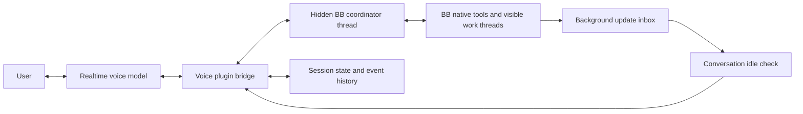

# Voice conversation coordinator

Status: implemented as an opt-in setting (Settings → Coordinator) on
7 September 2026 against BB 0.42.1 and Plugin SDK 0.4.47. The README's
"Coordinator mode" section records what is verified and what still needs a
physical call. This document remains the design reference.

## Intended behavior

Keep the current fast voice connection. Use a real, hidden BB thread to interpret
requests and coordinate work through BB's native tools. Let clear instructions
proceed within their authorized scope. Ask a question when the target or intent
is materially ambiguous, or when BB requires approval. Do not ask for confirmation
before every message, archive, or other action.

Background thread updates must wait until the user has finished speaking, the
current question has been answered, audio playback has finished, and the
coordinator is idle. Other coding threads can continue working during this time.

The first release keeps the existing Realtime model and turn-detection settings.
Model changes and semantic turn detection are separate experiments after this
behavior works.

## Decisions confirmed in Grill

- Use a trusted coordinator with native BB tools. Do not build a restricted
  executor for this release.
- Watch only threads discussed in the conversation, delegated to, or explicitly
  selected by the user.
- Finish accepted requests after hangup, then stop the coordinator runtime.
  Delegated workers continue independently.
- For "I think we can archive it. Nothing remains, right?", verify the condition,
  then answer and archive if it holds. Do not require a second confirmation.
- Resume the last logical conversation by default. Provide New conversation.
- Target 3–5 seconds from end of speech to the first useful answer for normal
  requests. Filler does not count as an answer.
- Bare "stop" stops speech and holds unsent handoffs. It does not stop accepted
  coordinator work or worker tasks without an explicit task-stop request.
- After a gap, give a brief digest of important results and unresolved blockers
  at the next idle boundary, after answering the user's opening request.
- Give the coordinator its own provider/model setting, independent of project
  defaults.

## Evidence and scope

The 6 September voice session showed a wrong answer to "which thread?" after an
announcement and a conditional comment rewritten into an instruction to remove
and revert files. The user clarified that the conditional archive request does
authorize archive once its condition is verified. Test that distinction; do not
treat every conditional request as requiring confirmation. Keep the private
transcript outside Git.

This belongs in the Voice Mode plugin. Existing BB contracts cover the required
thread visibility, messaging, history, interactions, and plugin tools. No upstream
change is currently required for the proposed behavior.

Verified contracts:

- `threads.spawn` supports `visibility: "hidden"`; SDK plugin calls receive plugin
  attribution. Hidden threads are excluded from ordinary sidebar organization and
  attention counts, but remain accessible by ID.
- A child inherits its parent's visibility unless explicitly set. Hidden status
  is organization, not a permission boundary.
- `threads.send`, native `bb thread tell`, queues, stop, thread history, and event
  cursors support ordinary coordination. Select steer or queue deliberately.
- `bb.agents.configure` can select this plugin's own registered tools and
  instructions for its coordinator. It cannot remove arbitrary native tools.
- `bb.agents.registerTool` supplies the calling thread ID for validating a
  coordinator reply. Lifecycle events include hidden threads.
- Existing Voice announcement publishing explicitly excludes hidden threads.
  Coordinator replies therefore need their own route.
- The Activity plugin uses BB's sidebar thread hook. Verify hidden-thread
  exclusion in both the native sidebar and this replacement during integration.

Inspected the published SDK declarations for the repository's pinned 0.4.47
version. A first integration check must confirm these contracts in the running
app, especially initial coordinator tool selection and pending interactions.

## Architecture

The voice model handles listening, short conversational answers, and speaking
coordinator results. Give it `delegate_to_coordinator` and `remain_silent`, plus
read-only current-view context. Remove its direct send, start, stop, archive,
rename, standing-instruction, and general plugin-command tools. It must not have
an alternative route that bypasses the coordinator.

The coordinator resolves thread references, interprets intent, decides whether a
question is necessary, and uses BB's native capabilities to inspect or control
work. It delegates repository work to the appropriate existing or new thread.
It does not edit product repositories from its own workspace.

The plugin bridge owns ordering, delivery receipts, duplicate detection, call
ownership, and structured state. These responsibilities must not depend only on
model instructions. The bridge also applies bounded presentation requests from
the coordinator to the calling client's existing mobile drawer or desktop view.
Reuse the current navigation behavior; do not lose the mobile call by navigating.

## Coordinator lifecycle

- One coordinator per logical voice conversation. Several physical calls can
  resume that conversation; each call still has its existing nonce and sequence.
- Create the coordinator at call startup in a dedicated personal environment on
  the selected BB machine. Use the personal project, not a product worktree.
  Resolve the personal environment through supported BB APIs before spawning.
- Persist its ID before sending user work. Use plugin origin attribution during
  initial configuration so its tools are present on the first turn. Reconcile a
  partially completed create before retrying; never create duplicate coordinators
  after a timeout without checking BB state.
- Add a dedicated coordinator provider/model setting. Validate it against the
  provider catalog; do not inherit entry-project execution defaults. Document
  the initial supported choice and measure it against the latency target. Keep
  it stable while the user moves between projects. Preserve normal permissions;
  do not force full permissions to make voice seamless.
- Initialize with coordinator instructions and bounded context while audio
  connects. Small talk can work while it starts; do not send work until ready.
- Keep the coordinator available during the active call. Normal hangup closes
  audio immediately, but accepted requests finish before its runtime stops.
  For a request to contact three threads, hangup after the first send must not
  discard the remaining two sends. Do not create new work from a transcript tail.
- A request is accepted when the bridge durably records its completed input,
  scope, and receipt. Partial speech, speculative tool arguments, and a spoken
  acknowledgement alone do not establish acceptance. Drain accepted requests
  that have not yet reached BB as well as those already in progress.
- Stop the runtime after accepted work completes, fails, or needs user input.
  Preserve and surface unresolved questions outside the call. If runtime stop
  cancels a native interaction, record that cancellation and recreate the
  unresolved question on resume; never invent an answer or approval.
- Reattach a replacement call to the same logical coordinator. New conversation
  creates a separate coordinator; the previous one finishes accepted work
  without speaking into the new call. On plugin shutdown or unrecoverable failure,
  checkpoint state, release resources, and reconcile on restart. Do not promise
  uninterrupted execution across process loss.
- Do not stop or archive delegated work when a call ends. Resume the last logical
  conversation by default and reconcile current task state without replaying
  actions. Provide an explicit New conversation control.
- Do not parent ordinary work under the coordinator. Create new work explicitly
  visible, in its intended project and environment, so coordinator cleanup cannot
  cascade into user work. Keep existing thread parent relationships intact.
- Offer "Open coordinator" in Voice session details for inspection and recovery.
  It remains hidden from ordinary sidebar lists. No automatic history deletion.

## Input, context, and replies

Define versioned envelopes validated at the plugin boundary.

User input includes a conversation ID, call sequence, request ID, utterance/item
IDs, transcript revision, original words, relevant transcript delta, and a
snapshot of the viewed thread and project. Keep the voice model's interpretation
in a separate optional field. Do not present that interpretation as user text.

Bind a delegation to a completed input item and the most recent corrections.
If tool arguments arrive before input transcription, wait for that item to settle
before sending executable work. If the user resumes the same unfinished thought,
hold the pending handoff and include the correction. Measure this added wait.

Use one persistent coordinator conversation. Send a new request when idle;
steer when the user changes ongoing coordinator work; use a queue for explicit
"after this" requests. Pass the user's own wording and scope to destination
threads. Never upgrade "is this needed?" into "remove it".

Register a coordinator-only `voice_reply` tool with structured fields for:

- The request or update batch being answered and relevant task/thread IDs.
- A short answer or question, with a separate optional display detail.
- Whether this is a progress update, final reply, clarification, or silent result.
- Action receipts that cite actual BB results, including pending or unknown state.
- Suggested conversation-state changes and presentation requests.

Validate the calling thread against the stored coordinator mapping. Generate
reply identity and sequence in the bridge. Final replies wait for the corresponding
coordinator turn to settle and the user to be quiet. Clarifications and native
approvals can be presented while the coordinator waits for input; requiring idle
would deadlock that exchange. Useful progress can also be presented at a quiet
boundary, but must not claim completion. Unrelated background updates always use
the full idle gate below.

Keep a native question invocation alive until an answer or explicit cancellation
arrives. Track UI submission separately from successful answer delivery. A form
submission must not be reported as received merely because the UI accepted it.
Reconcile delayed answers, hangup, runtime shutdown, and cancelled interactions.

Observe coordinator failure, idle, and pending-interaction events separately.
Use its final assistant text as a bounded fallback when there is no structured
reply. Do not parse arbitrary prose or fenced JSON as an executable action.
Consume event sequences once and avoid speaking both the tool reply and fallback.

Store structured state outside the model context: current topic, discussed thread,
viewed thread, unresolved question, active tasks, authorized scopes, latest
announcement, and update delivery state. Rebuild bounded coordinator/voice context
from it on resume or compaction. Context changes are not new user instructions.

## Action policy without routine confirmations

The coordinator may act on a clear request with a resolved target. Examples:

| User request | Expected behavior |
| --- | --- |
| "Ask the activity thread to fix that review comment and push." | Send that scope to the resolved thread and report acceptance. |
| "Archive the old speech thread." | Resolve the old thread, check relevant state and archive scope, then archive. |
| "I think we can archive it. Nothing remains, right?" | Resolve the target and verify that nothing remains. If true, answer and archive without a second confirmation. If false or unknown, explain and do not archive. |
| "If this is already built in, we do not need our copy." | Verify or request investigation; preserve the conditional wording. Do not invent a destructive instruction. |
| "Keep addressing review comments until this PR is ready." | Authorize that bounded workflow. It does not grant merge or unrelated publication authority. |
| "Yes" after a topic change | Do not treat it as approval of an older pending action. |

Respect user corrections, existing project instructions, and normal BB approval
rules. Surface pending interactions from hidden coordinator or managed work
threads in the Voice view, with the exact target and requested action. Permit a
spoken answer only when it unambiguously maps to the active interaction and its
supported response schema. Otherwise use the native interaction UI. Never
automatically approve permissions on the user's behalf.

Deterministic guarantees in this release apply to bridge dispatch and reply
delivery. A coordinator with ordinary BB CLI access is a trusted agent, not a
sandbox imposed by this plugin. Do not claim that the plugin can veto every
native archive or shell action, or that a natural-language classifier proves
authorization. Arbitrary native-tool interception would need a separate BB
capability design; it is outside this plan.

## Background updates and conversational turns

Persist incoming updates immediately, but do not inject them into an active
coordinator turn or start a voice response for each event. Retain source thread,
source event/turn identity where available, status, and bounded result text.
Treat thread output as data, not instructions or user authorization.

Maintain a durable watch set for discussed, delegated, and explicitly watched
threads. Incidental search results do not add a thread. Support explicit removal
from the watch set. Restore it on resume and reconcile missed events. After a gap,
wait until the opening request is answered, then give a brief digest of important
results and unresolved blockers at the next idle boundary. Do not read the full
missed history aloud or announce unrelated workspace activity.

An update batch can be selected only when all of these conditions hold:

1. The user is not speaking and no input/transcription remains unresolved.
2. The current user request has a settled answer, or was explicitly parked.
3. The coordinator is idle, with no pending user steer or reply.
4. Voice generation and audio playback have both finished.
5. No blocking clarification or permission decision is waiting for the user.
6. A short quiet interval has elapsed. Start with the existing two-second value.

This is conversation idle, not a requirement for all coding threads to stop.

Reserve a batch at this boundary and send it to the coordinator as background
data. That begins a separate digest turn. It may return a short grounded update
or remain silent. Recheck the conversation revision and playback conditions
before speaking the digest. If the user starts speaking during preparation,
give the new input priority and retain the undelivered batch for later.

Coordinator processing of a digest must not create authority for new work.
It may continue an already authorized workflow. Autonomous review follow-up is
best delegated to the work thread so a busy voice conversation does not delay it.

Coalesce repeated status changes per thread while preserving failures and
unresolved blockers. Limit each spoken batch to two concise updates; keep the
rest queued. Skip already-read information. Exclude coordinator lifecycle events
and delivery acknowledgements so the digest cannot trigger its own update loop.

Add the announced facts and thread identity to main voice context as bounded,
labelled data, without triggering another response. Track generated, playing,
interrupted, and delivered separately. Do not equate generation completion with
what the user heard. If precise played text is unavailable, record partial
delivery without inventing a word boundary. "Which thread?" can then resolve to
the interrupted or latest announcement instead of the previously viewed thread.

## Interruptions, recovery, and latency

Starting to speak stops current assistant audio and supersedes unsent speculative
handoffs. It does not revoke an accepted instruction or stop authorized workers.
Send substantive corrections as coordinator steering. Distinguish "stop talking",
"wait, wrong thread", "stop that task", and "end the call".
Bare "stop" stops speech and holds unsent handoffs. Accepted coordinator requests
and worker tasks continue unless the user explicitly asks to stop that work.

Use call sequence and conversation revision checks to reject stale bridge work.
Record each handoff before dispatch and its native BB acceptance afterward. On an
ambiguous timeout, reconcile BB history before any retry. This prevents bridge
replays; it does not promise exactly-once execution of arbitrary agent commands.
If an action has already started, report its real state instead of claiming that
interrupting speech cancelled it.

Keep WebRTC and audio processing independent of coordinator latency. Do not keep
a realtime tool call blocked until a coding task finishes: acknowledge the
coordinator handoff promptly, then return later results through the reply bridge.
Avoid filler speech while waiting. Show a quiet "Working" state when useful.

If the coordinator fails, retain the user's request, report the failure, and
offer retry or direct thread access. Never fall back to direct voice mutations.
If the client disconnects, retain update and reply delivery state. Reconnect must
not replay completed actions or stale speech. A stopped call cannot receive late
speech from its old coordinator. Dispose listeners and release stopped runtimes.

## Implementation sequence

1. **Thread integration and lifecycle.** Add coordinator settings, persistent
   conversation mapping, hidden spawn/resume/stop, initial tool selection, and
   pending-interaction routing, and completion of accepted requests after hangup.
   Prove native communication with a disposable
   visible work thread. Verify personal-environment ownership and cleanup.
2. **Handoff and reply bridge.** Add validated envelopes, original transcript
   delivery, request receipts, structured replies, context synchronization, and
   current-client presentation. Replace direct voice mutation tools. Keep the
   existing voice connection and mobile drawer.
3. **Conversation state and update scheduler.** Add the durable inbox,
   watch set, idle conditions, reserved batches, interruption handling, and
   announcement context.
   Distinguish user requests from updates in both storage and model context.
4. **User controls and recovery.** Add Open coordinator, pending work/status,
   current clarification, dedicated provider/model settings, New conversation,
   and watch controls. Handle failed starts, rate limits, reload, call replacement,
   disconnect, and default resume of the last conversation.
5. **Verification and staged activation.** Run deterministic scenarios first,
   then local voice tests. Activate the complete coordinator path as an opt-in
   setting until it passes. Do not silently return to the previous direct-action
   path on errors. Keep rollback explicit and preserve session history.

Expected implementation areas: `server.ts`, `voice-agent.ts`, `voice-realtime.ts`,
`session-events.ts`, settings/session components, and new focused modules for
coordinator lifecycle, conversation state, envelopes, and update scheduling.
Use the plugin database for new versioned tables and migrations.

## Acceptance checks

- A hidden coordinator starts once, is absent from both sidebar lists, is directly
  inspectable, and communicates with a visible work thread through native BB.
- Clear commands execute without a routine second confirmation. Conditional
  questions and materially ambiguous targets do not become invented instructions.
- The conditional archive example executes after the condition is verified,
  without another confirmation. A false or unknown condition does not archive.
- The receiving agent sees original words and the relevant correction/context.
- An update arriving during speech, response generation, playback, coordinator
  execution, or a pending clarification does not interrupt the exchange.
- At the next idle boundary, queued updates can be delivered even while unrelated
  workers run. Bursts, duplicate events, missing results, and untitled threads
  produce bounded, correctly attributed output.
- Only watched threads produce automatic updates. Resume restores the watch set
  and gives a brief missed-update digest after the opening request is answered.
- "Which thread?" immediately after an announcement answers with that update's
  source. Interrupting a digest preserves undelivered updates and the prior topic.
- A late reply from an old request or call cannot overwrite the current topic or
  speak in a new call. Coordinator idle and tool reply events do not double-speak.
- An interrupted pending handoff does not dispatch; an already accepted task is
  not falsely reported cancelled. Ambiguous network failures do not duplicate
  sends, spawns, retries, or archives.
- Hidden-thread approval requests remain visible and actionable. An unrelated
  "yes" cannot resolve a pending interaction from another topic.
- A clarification can reach the user while the coordinator waits for its answer.
  A delayed form submission remains deliverable while its invocation is pending.
  Hangup, reload, and cancellation preserve an unresolved question for recovery;
  UI submission alone never counts as successful delivery to the agent.
- Hangup after the first of three accepted sends completes the remaining sends,
  then releases the coordinator runtime. Partial speech creates no new request.
  A blocker is surfaced outside the call; delegated workers are not stopped.
- Bare "stop" stops audio and holds unsent handoffs while accepted work continues.
- Resume restores the last conversation and current task state without repeating
  actions. New conversation is separate and receives no old-call speech.
- The coordinator model remains independent of project defaults. An unavailable
  provider or model produces a recoverable error, without direct voice mutations.
- Desktop and mobile calls retain current focus/drawer behavior. Call replacement
  across windows preserves one owner and one coordinator mapping.

Use fake SDK/realtime tests for ordering and lifecycle cases, provider integration
tests for handoff/interaction behavior, and physical desktop/mobile calls for
audio interruption and playback. Use real harmless actions only in disposable
test threads. Add no private transcript or audio to Git.

Record baseline and revised median/p95 end-of-speech to first useful answer,
coordinator warm/cold handoff delay, correction delivery time, and idle-to-update
delay. Count false interruptions, wrong-thread references, duplicate dispatches,
and unnecessary clarification prompts. Acceptance requires no such correctness
failures in the defined scenarios. Target 3–5 seconds to the first useful answer
for normal warm requests; filler does not count. Report cold starts and requests
that require slow external verification separately. Do not trade verified action
results for faster claims of success. Compare latency on matched calls before
enabling this by default.

## Research references

- [OpenAI voice architecture](https://openai.com/index/continuous-voice-interaction-with-gpt-live/): separate live audio and asynchronous execution; provisional and final conversation state.
- [Codex voice tools](https://github.com/openai/codex/blob/ad931a45b201e3877d6ba542ba5dbbd85e7e31b4/codex-rs/codex-api/src/endpoint/realtime_websocket/methods_v2.rs): delegation with original user wording and an explicit silent outcome.
- [Codex delegation context](https://github.com/openai/codex/blob/ad931a45b201e3877d6ba542ba5dbbd85e7e31b4/codex-rs/core/src/context/realtime_delegation.rs): request plus bounded transcript delta.
- [Codex history](https://github.com/openai/codex/blob/ad931a45b201e3877d6ba542ba5dbbd85e7e31b4/codex-rs/core/src/realtime_history.rs): session-linked transcript and work history.

These sources inform the design. They do not establish which experimental Codex
path a particular desktop build uses, or guarantee the behavior of this plugin.
